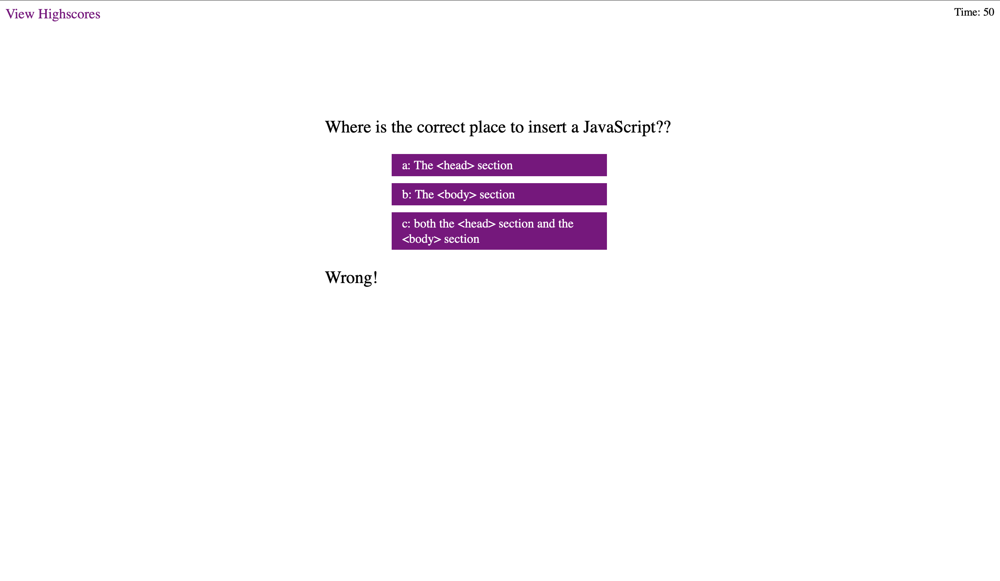

# javaScript-Quiz

### Description

It is an application that allows a user to take javascript related quiz. It provides list of answers along with relevent question and user can select the appropriate one . And at the end of the quiz user can review the total score and compare with highest score. This app will run in the browser and feature dynamically with updated [HTML](https://developer.mozilla.org/en-US/docs/Web/HTML), [CSS](https://developer.mozilla.org/en-US/docs/Web/CSS), and [javascript](https://developer.mozilla.org/en-US/docs/Web/JavaScript). 

## Feature List:

* User will have list of multiple answers choice.
* User will notify either answer is right or wrong instantly.
* User will have access to view the highest score.
* User can save his/her name and scores.
* User can clear all the stored scores.

The local storage is used here to store all the saved score. For the conveninet, and clear look, it has made simple, responsive, and colorful with appropriate css style. 

## Screenshots:
### When you made right answer selection.

 

### When you made wrong asnwer selection.  

 

### When you complete answered all the questions.  

 

### Highscore page for all the recorded scores.  

 

## Links :

* Link for the deployed application [javaScript-Quiz](https://github.com/Rajesh295-dev/javaScript-Quiz.git)
* Link for the Github repository [Host by Github](https://rajesh295-dev.github.io/javaScript-Quiz/)

## Contributors:

* [Rajesh Gautam](https://github.com/Rajesh295-dev)

- - -
 